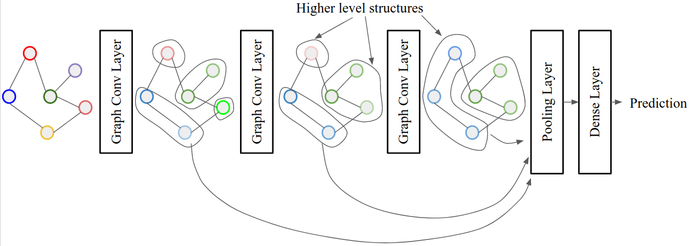

# Graph Classification with Multi-Scale Features
This is the final project for the Machine Learning course COMP562.001.SP19. The project is on graph classification using Graph Convolutional Network (GCN).

## Network Architecture

### Description
The building block of our network is a graph convolution layer introduced in [1]. This layer incorporates 
neighborhood information into each node to update it's feature. We have used several these GCN layers to
generate feature at different scales. Then we concatenate the output from each of these layers to build a
multi-scale representation of the node features. This concatenation is basically skip connections that help the gradient flow to the earlier GCN layers to solve oversmooting probelm. To go from node level feature to graph level feature we used
two different pooling mechanism -- *Max Pooling* and *k-max Pooling*.

## Run the code
Dependecies:
- python3
- torch
- torch_geometric

Run: `python3 main.py`

## Code Organization
- `model.py` contains the network architecture
- `train_test.py` contains the training and testing code
- `settings.py` contains global arguments shared accross all files. Change the dataset name here to run this for different datasets.
- `utils.py` contains some utility functions
- `main.py` is the entry point of the code

## Dataset
PROTEINS and ENZYMES dataset collected from here: https://ls11-www.cs.tu-dortmund.de/staff/morris/graphkerneldatasets

## References
[1] T. Kipf and M. Welling. *Semi-Supervised Classification with Graph Convolutional Networks*. ICLR 2017.
